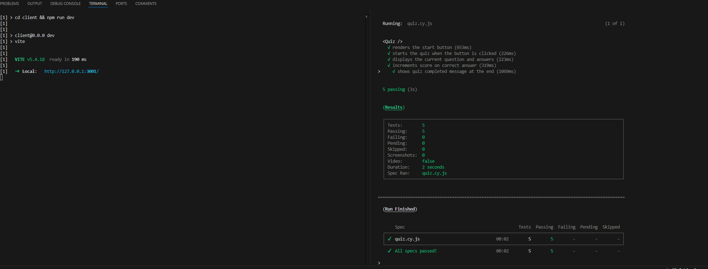
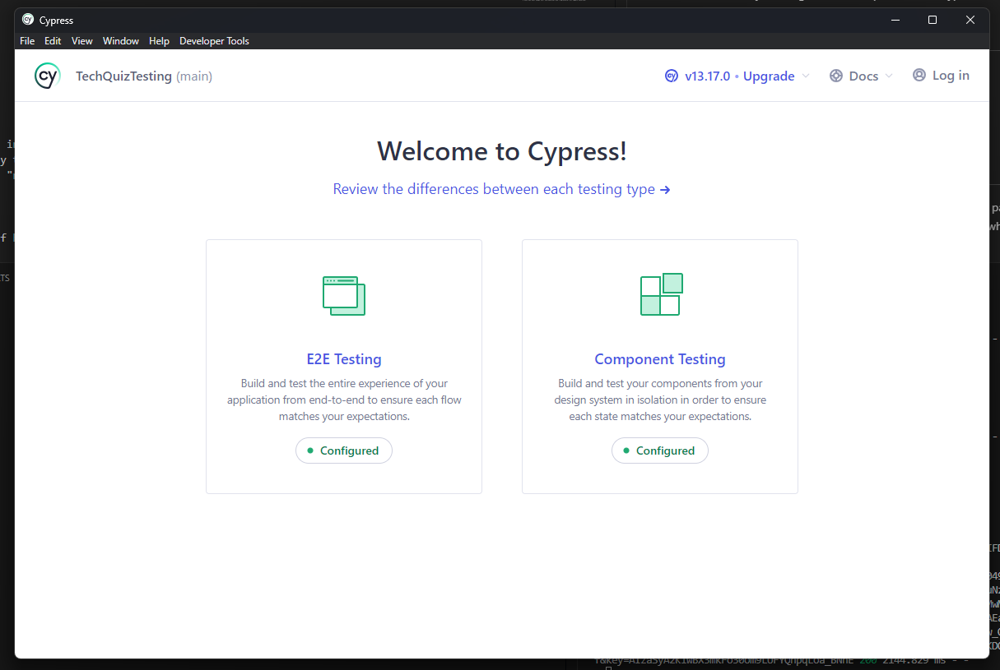
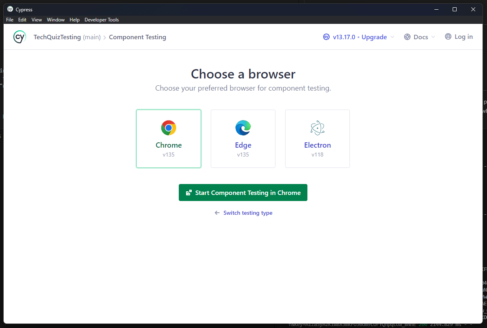
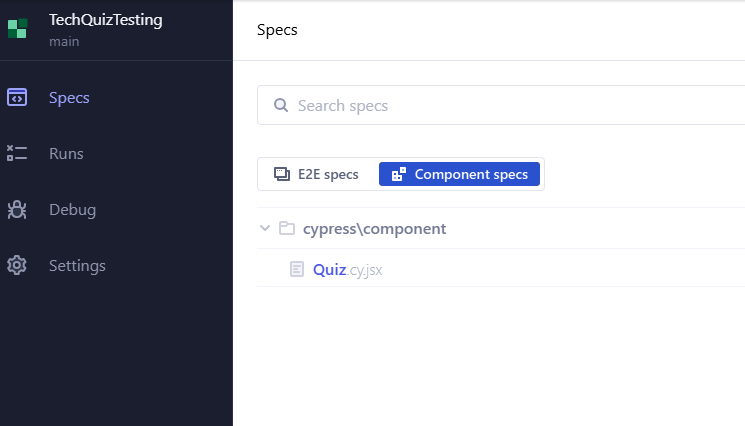
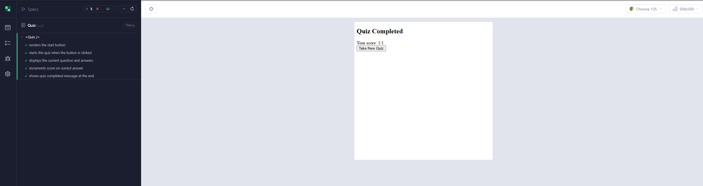
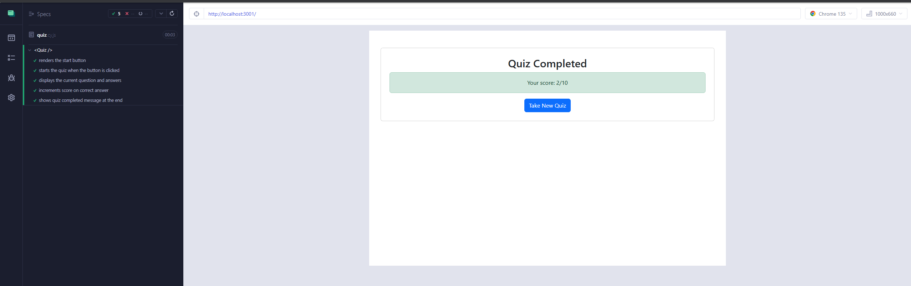

# Tech Quiz Testing

## Description

This project is a tech quiz app with the implementation of Cypress to use for testing. The quiz consists of ten random questions and at the end is a final score with a button that allows users to retake the quiz. The app was built using the MERN stack with a React front end, MongoDB database, and Node.js/Express.js server and API. The goal of this project was to develop a better understanding of how to develop test cases for testing apps and concepts behind testing. This contributed to my learning of how to implement/use Cypress testing to a project and commands/instructions for testing code development.

## Table of Contents

- [Description](#description)
- [Installation](#installation)
- [Usage](#usage)
- [Credits](#credits)

## Installation

To run locally, run a "npm run install" in the terminal to have all packages installed. After doing so, run a "npm run build" and "npm run start:dev". This way the app is built and is ran locally. For Cypress testing, split the terminal when the app is running locally and run "npm run cypress" in the split terminal.

## Usage

Here is a link to a walkthrough video of how to run testing: [Walkthrough Video](https://drive.google.com/file/d/1qicMGYOGjEVtEEkMKSbMKbRpqSfBbQ8O/view)

Below are screenshots of what to expect when running the tests.

This is a visual of splitting the terminals to run the app and the tests in the terminal/cypress.

This is the Cypress popup when the cypress command is ran. You can choose to run E2E testing or Component testing.

After choosing what testing you want to test, you will be asked what browser you want to test on.

Once a browser has been decided, this is the page that will be presented afterwards.

This is what component testing will look like.

This is what e2e testing will look like.

## Credits

Below is my GitHub profile. Any suggestions to improve functionality and code, feel free to reach out to me!

GitHub: https://github.com/AVue00

